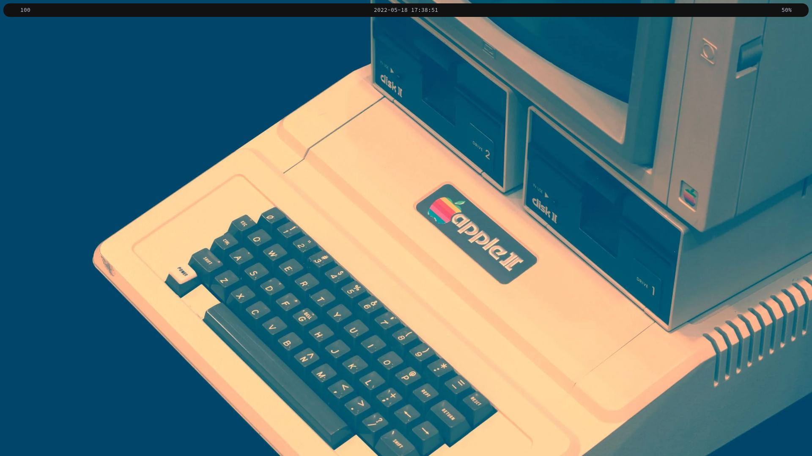
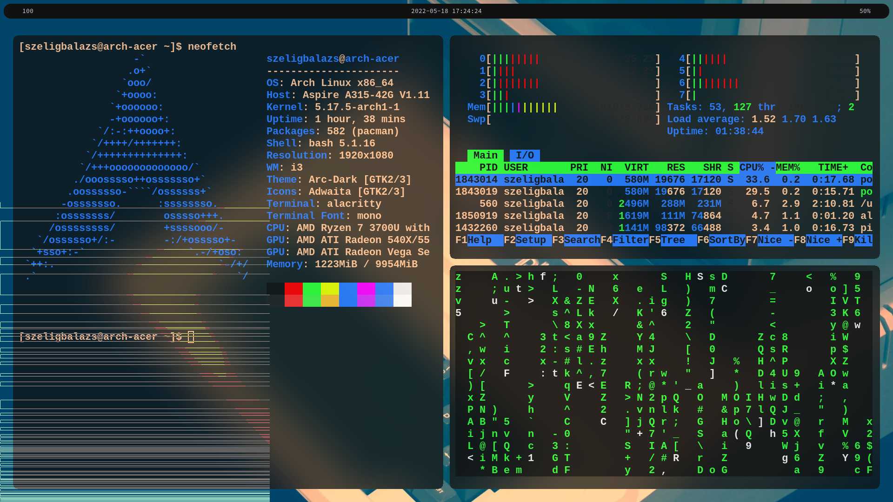

# Dotfiles
Hello! This is my dotfiles. 
If you like it you can clone and use them.

```
git clone https://github.com/SzeligBalazs/dotfiles.git
```
## Previews


<br>



## You'll need:

- i3wm
- i3gaps (i3-gaps-rounded-git)
- alacritty
- polybar
- rofi
- neovim


I hope you like it.
##### :D
